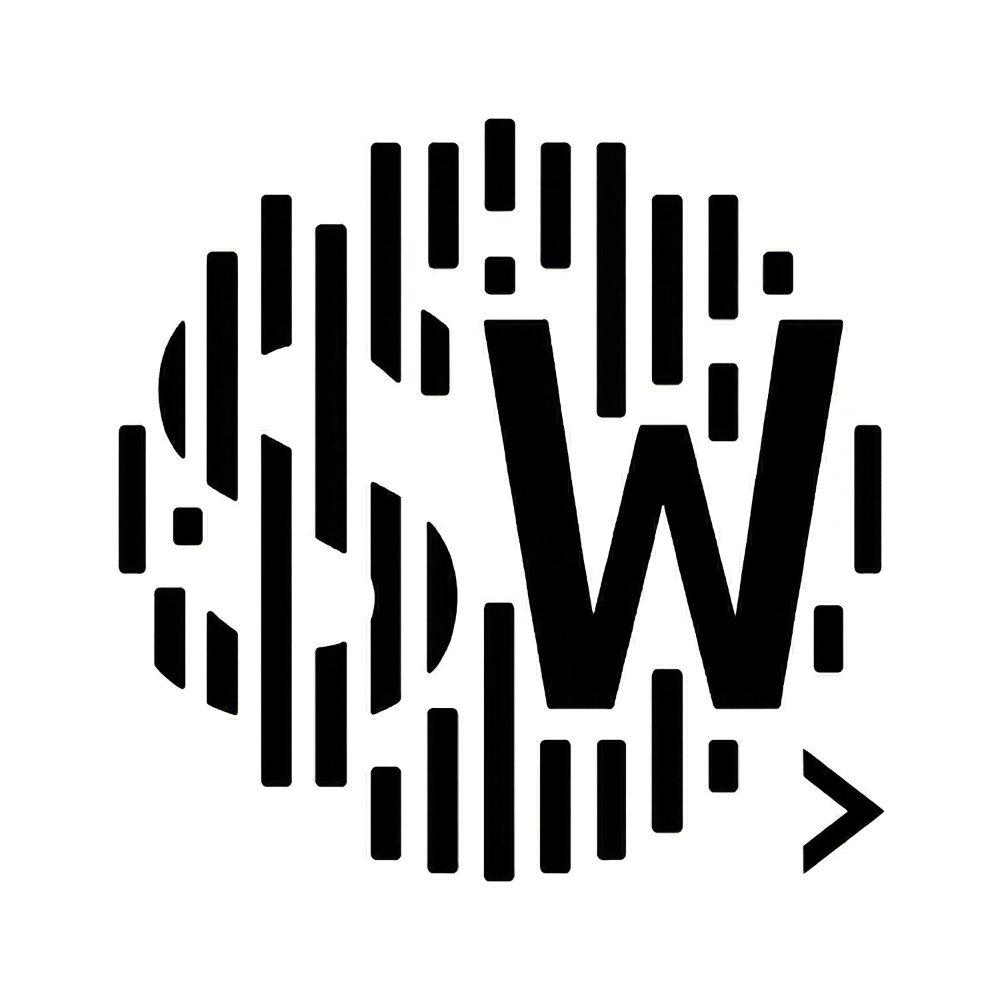
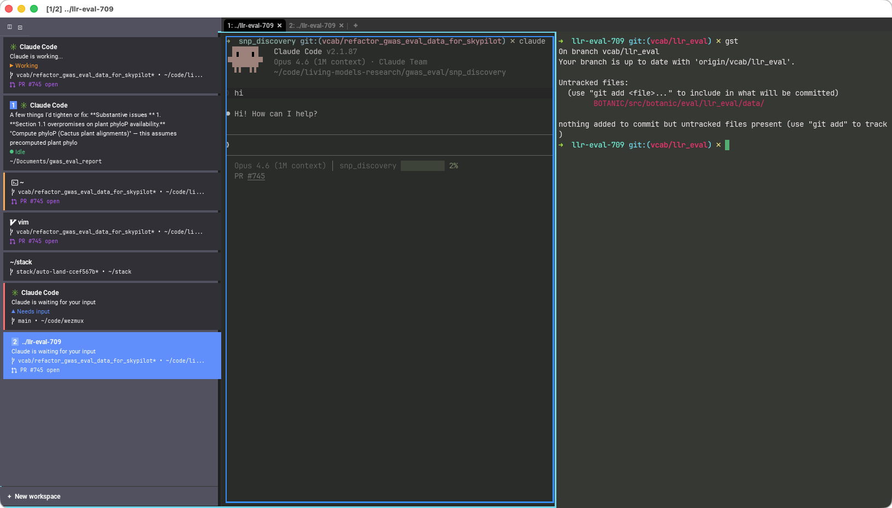

<p align="center">
  
</p>

# Wezmux

A fork of [WezTerm](https://github.com/wezterm/wezterm) that adds workspace management for multi-agent terminal workflows. Built as a personal tool for running multiple AI coding agents side-by-side and knowing at a glance which workspace needs attention.



## What's different from WezTerm

**Persistent sidebar** showing per-workspace metadata:
- Git branch and dirty status
- PR number and status (via `gh` CLI)
- Listening ports
- Agent status line (via OSC 7777)
- Unread notification badges

**Notification system** with visual indicators:
- Blue ring on panes with unread notifications
- Badge counts in the sidebar
- Toast-style notifications via OSC 9 / OSC 777

**OSC 7777 agent status protocol** for structured status reporting:
```
\e]7777;status;working;Running tests\a
```

**Session save/restore** on quit and relaunch:
- Workspace layout and split pane structure preserved
- Per-pane CWDs restored
- Scrollback history with ANSI colors
- Sidebar metadata cache (no blank-state flash on relaunch)

**Workspace management:**
- Deterministic workspace naming
- "New workspace" button pinned to sidebar bottom
- Click sidebar entries to switch workspaces

**Keyboard shortcuts:**
| Shortcut | Action |
|----------|--------|
| `Cmd+B` | Toggle sidebar |
| `Option+U` | Jump to last unread notification |
| `Option+1..9` | Switch to workspace by index |

## Install

### Prerequisites

- **Rust toolchain** — installed automatically via `rust-toolchain.toml` once rustup is present. To install rustup:
  ```bash
  curl --proto '=https' --tlsv1.2 -sSf https://sh.rustup.rs | sh
  ```
- **Xcode Command Line Tools** — needed for C dependencies (harfbuzz, freetype, libpng, zlib):
  ```bash
  xcode-select --install
  ```
- **`gh` CLI** (optional) — enables PR status in the sidebar:
  ```bash
  brew install gh
  ```

### Clone

```bash
git clone --recursive https://github.com/vcabeli/wezmux.git
cd wezmux
```

If you already cloned without `--recursive`, run:
```bash
git submodule update --init --recursive
```

### Build and install

```bash
make install
```

This builds release binaries, assembles `Wezmux.app`, ad-hoc codesigns the main binary, and installs to `/Applications/Wezmux.app`.

To install to a custom location:
```bash
APP_DIR=~/Applications/Wezmux.app make install
```

### Development build

Build to `target/Wezmux.app` without touching `/Applications`:

```bash
make bundle
open target/Wezmux.app
```

## Config

Wezmux shares `~/.wezterm.lua` with WezTerm. Guard Wezmux-specific fields so stock WezTerm doesn't error:

```lua
pcall(function()
  config.sidebar = { width = '400px' }
end)
```

## Credits

Built on top of [WezTerm](https://github.com/wezterm/wezterm) by [@wez](https://github.com/wez). All the heavy lifting (GPU renderer, terminal emulation, multiplexer) is WezTerm's.
