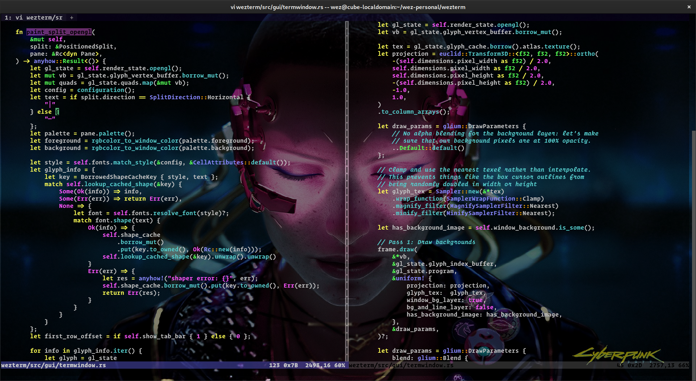
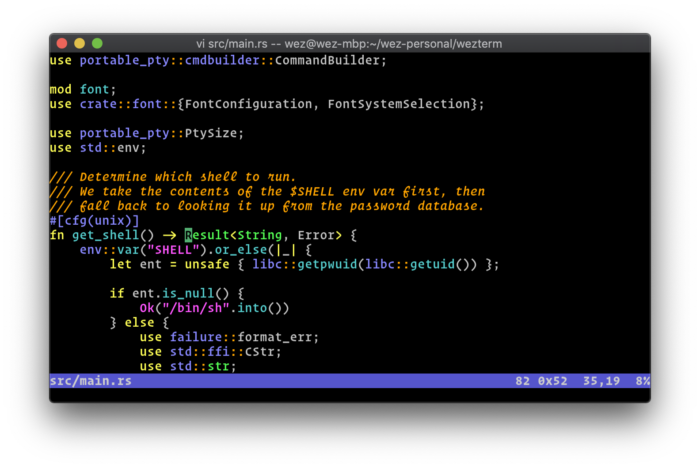

---
hide:
  - toc
---

*Wezmux is a workspace-aware terminal for multi-agent workflows, built on top of WezTerm and implemented in <a href="https://www.rust-lang.org/">Rust</a>*

[Download :material-tray-arrow-down:](installation.md){ .md-button }

## Features

* macOS-first workspace management for parallel coding-agent sessions
* A persistent sidebar with git, PR, port, notification, and agent-status context
* [Multiplex terminal panes, tabs and windows on local and remote hosts, with native mouse and scrollback](multiplexing.md)
* Font fallback, true color, hyperlinks, and the broader terminal foundation inherited from WezTerm
* [A full list of inherited terminal features can be found here](features.md)

Looking for the Wezmux-specific [configuration reference?](config.md)

**These docs are searchable: press `S` or click on the magnifying glass icon
to activate the search function!**

<figure markdown>

<figcaption>Screenshot of Wezmux on macOS</figcaption>
</figure>
