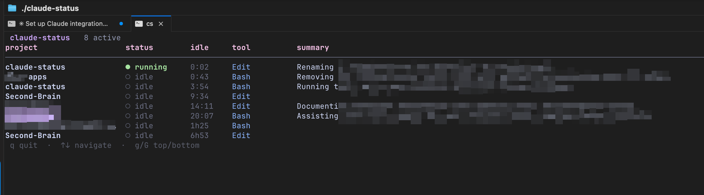

<h1 align="center">claude-status</h1>

<h3 align="center">A terminal control tower for all your Claude Code sessions — a macro view of what every agent is doing, with live status, idle time, and one-line AI summaries. Built for running many agents at once.</h3>

<p align="center">
  
</p>

> Lives in the [wezmux](../../) repo under `tools/claude-status`. Originally
> [claude-tower](https://github.com/PierrickMartos/claude-tower) (which sourced
> its live feed from cmux); this fork drops cmux entirely. State is fed by a
> tiny Claude Code hook — `claude-status hook` — that records each session as it
> runs, so the dashboard sees every session no matter how `claude` was launched
> (alias, `--resume`, `--continue`, git worktree, any terminal). Launch it from a
> wezmux pane or anywhere.

## Features

|  |  |
|---|---|
| **Every session, one screen** | A Claude Code hook records each session to a small per-session state file; the dashboard reads them into a live registry — across projects, worktrees, and terminals. No cmux, no daemon, no polling of `ps`. |
| **Status at a glance** | `running` / `awaiting` / `idle` (straight from the hook events, so it's accurate) with per-session idle timers and the last tool each agent touched. |
| **AI summaries** | A debounced Haiku call turns the last ~20 transcript messages into a one-line "what is this session actually doing" summary. |
| **Zero config auth** | Reuses the OAuth token from your existing Claude Code login in the macOS keychain — no API key, no env var. An Anthropic API key or AWS Bedrock work too, via the same env vars Claude Code uses. |

## Install

> **macOS only.** Requires a recent Claude Code install. No cmux, no other runtime dependency.

```bash
# 1. Install Go (one-time)
brew install go

# 2. From the wezmux repo:
cd tools/claude-status
go build -o claude-status .

# 3. Run — by default auth is read from your Claude Code login (macOS keychain).
#    If you're not logged in yet, run `claude` once to authenticate.
#    An API key or AWS Bedrock work too — see Auth below.
./claude-status
```

### Wire up the hook (required to see sessions)

claude-status learns about sessions from a Claude Code hook. Add `claude-status hook`
to your `~/.claude/settings.json` for these events:

```json
{
  "hooks": {
    "SessionStart":     [{ "hooks": [{ "type": "command", "command": "/absolute/path/to/claude-status hook" }] }],
    "UserPromptSubmit": [{ "hooks": [{ "type": "command", "command": "/absolute/path/to/claude-status hook" }] }],
    "Notification":     [{ "hooks": [{ "type": "command", "command": "/absolute/path/to/claude-status hook" }] }],
    "Stop":             [{ "hooks": [{ "type": "command", "command": "/absolute/path/to/claude-status hook" }] }],
    "SessionEnd":       [{ "hooks": [{ "type": "command", "command": "/absolute/path/to/claude-status hook" }] }],
    "PreToolUse":       [{ "matcher": "*", "hooks": [{ "type": "command", "command": "/absolute/path/to/claude-status hook" }] }],
    "PostToolUse":      [{ "matcher": "*", "hooks": [{ "type": "command", "command": "/absolute/path/to/claude-status hook" }] }]
  }
}
```

The hook reads the event JSON on stdin and writes `~/.cache/claude-status/sessions/<id>.json`.
It's the same binary, so no extra dependency. Hooks are read at session start, so
**only sessions started after wiring appear** — restart existing ones. These hooks
merge with any others (e.g. wezmux's), so they don't disturb your setup.

To launch the dashboard from a wezmux pane, bind a key in `~/.wezmux.lua`, e.g.:

```lua
-- Cmd+Shift+A: open claude-status in a side split
{ key = 'a', mods = 'SUPER|SHIFT', action = wezterm.action.SplitHorizontal {
    domain = 'CurrentPaneDomain',
    args = { '/opt/homebrew/bin/claude-status' },
} },
```

## Keyboard shortcuts

| Key | Action |
|---|---|
| `j` / `k` or `↑` / `↓` | Navigate rows |
| `g` / `G` | Jump to top / bottom |
| `q` | Quit |

## How it works

1. Claude Code fires the wired hooks; each runs `claude-status hook`, which reads
   the event (`session_id`, `cwd`, `transcript_path`, `hook_event_name`,
   `tool_name`) on stdin and writes/updates `~/.cache/claude-status/sessions/<id>.json`.
   Status maps from the event: prompt/tool events → `running`, `AskUserQuestion` /
   `Notification` → `awaiting`, `Stop` → `idle`, `SessionEnd` → removed.
2. The dashboard re-reads that feed every second and reconciles an in-memory
   registry keyed by session id. A session whose file is gone (SessionEnd) or
   stale (untouched > 12h) drops off.
3. A debounced (5s) per-session worker tails the last ~20 messages from the
   hook-reported `transcript_path` and sends them to `claude-haiku-4-5` for the
   one-line summary. (Using the reported path avoids the lossy cwd→path
   encoding that breaks for worktrees and dotted paths.)

## Auth

Three methods, resolved per call with the same env conventions Claude Code
itself uses:

| Precedence | When | Method |
|---|---|---|
| 1 | `CLAUDE_CODE_USE_BEDROCK` is truthy | **AWS Bedrock** — `InvokeModel` with the standard AWS credential chain (env, `~/.aws` profile, SSO, IMDS). Model defaults to `eu.anthropic.claude-haiku-4-5-20251001-v1:0`; override with `ANTHROPIC_SMALL_FAST_MODEL` (e.g. a `us.` inference profile). |
| 2 | `ANTHROPIC_API_KEY` is set | **API key** — direct Anthropic API call with `x-api-key`. |
| 3 | otherwise | **Claude Code OAuth** (default) — reads the access token your Claude Code login put in the macOS keychain (`security find-generic-password -s "Claude Code-credentials"`). Re-read on every call, so re-logging into Claude Code (which refreshes the token) is picked up automatically. |

If auth can't be resolved (no keychain token, expired token, AWS config
error) the summary falls back to the session's `slug` (auto-generated by
Claude Code, just less polished) — the UI keeps working either way.

> ⚠️ **Unofficial use (OAuth mode only).** Anthropic's OAuth tokens are issued
> for Claude Code traffic. Inference calls work and many community tools rely
> on it, but it's not officially supported, and rate limits draw from your
> subscription. The API-key and Bedrock modes are ordinary, fully supported
> API usage.

## Layout

- `main.go` — `hook` subcommand dispatch + the dashboard's read loop
- `internal/feed/` — the session feed: `RunHook` (writes state) and `Load` (reads it)
- `internal/registry/` — session state map; reconciles the feed each tick
- `internal/transcript/` — tails a transcript by path for the summary
- `internal/creds/` — auth resolution (keychain OAuth, API key, or Bedrock)
- `internal/summarizer/` — Haiku one-liner
- `internal/ui/` — Bubble Tea model

## Troubleshooting

| Symptom | Fix |
|---|---|
| Empty table | Hook not wired, or sessions predate the wiring. Confirm the `hooks` block in `~/.claude/settings.json` and **restart** your `claude` sessions — hooks only attach at session start. |
| A session never appears | Check it writes state: `ls ~/.cache/claude-status/sessions/`. If empty, test the hook: `echo '{"session_id":"x","hook_event_name":"UserPromptSubmit","cwd":"/tmp"}' \| claude-status hook` should create `x.json`. |
| Generic "[no summary]" rows | Not logged into `claude` yet, or first 5s debounce not elapsed |
| Rows show slug instead of summary | OAuth token expired — run `claude` once to refresh. In Bedrock mode: AWS config failed to load — check `AWS_REGION` / credentials |
